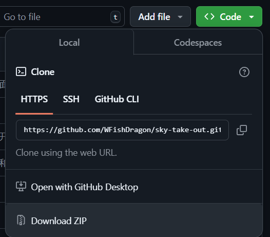
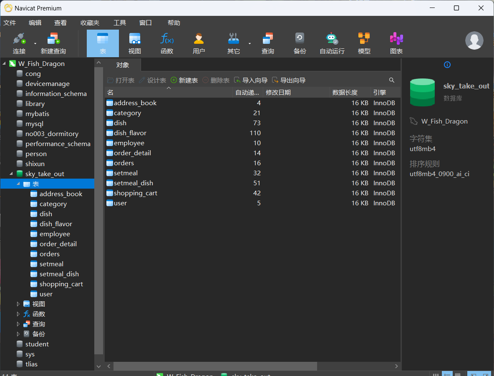
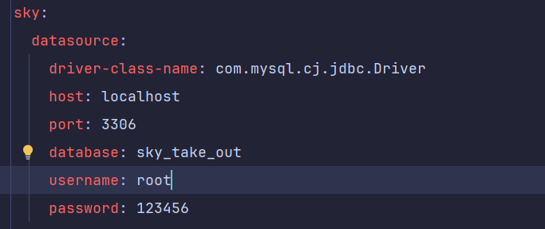
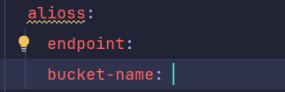
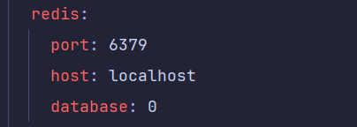
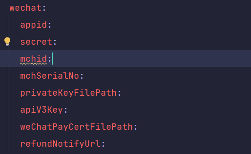

# 苍穹外卖
苍穹外卖学习记录(部分功能未完成如：微信支付功能)

<!-- PROJECT SHIELDS -->

[![Contributors][contributors-shield]][contributors-url]
[![Forks][forks-shield]][forks-url]
[![Stargazers][stars-shield]][stars-url]
[![Issues][issues-shield]][issues-url]

<!-- PROJECT LOGO -->

<p align="center">
  <a href="https://github.com/WFishDragon/sky-take-out/">
    
  </a>
  <p align="center">
    <br />
    <a href="https://github.com/WFishDragon/sky-take-out"><strong>探索本项目的文档 »</strong></a>
    <br />
    <br />
    <a href="https://github.com/WFishDragon/sky-take-out">查看Demo</a>
    ·
    <a href="https://github.com/WFishDragon/sky-take-out/issues">报告Bug</a>
    ·
    <a href="https://github.com/WFishDragon/sky-take-out/issues">提出新特性</a>
  </p>

</p>


## 目录
+ [上手指南](#上手指南)
    - [开发前的配置要求](#开发前的配置要求)
    - [安装步骤](#安装步骤)
+ [文件目录说明](#文件目录说明)
+ [开发的架构](#开发的架构)
+ [部署](#部署)
+ [使用到的框架](#使用到的框架)
+ [版本控制](#版本控制)
+ [作者](#作者)

### 上手指南
以下指南将帮助你在本地机器上安装和运行该项目，进行开发和测试。关于如何将该项目部署到在线环境，请参考**安装步骤**。


#### 开发前的配置要求
1. IntelliJ IDEA
2. MySQL数据库
3. Redis数据库
4. 微信开发者工具
5. 阿里云账号

### 文件目录说明
```plain
mp-weixin为微信小程序目录
nginx-1.20.2为服务器前端页面
sky_take_out.sql为MySQL数据库文件
```

#### **安装及运行步骤**
##### 一.项目安装
1. 方法1：
    + 获取你的github密匙以便使用克隆功能
    + 将项目克隆到你的电脑中

```shell
git clone https://github.com/WFishDragon/sky-take-out.git
```

+ 在IDEA中对项目进行导入
2. 方法2:
+ 点击Download ZIP下载到本地



+ 在IDEA对项目进行导入

##### 二.数据库导入
1.在自己的MySQL软件中对主目录下的sky_take_out.sql文件进行导入

成功如同：

##### 三.创建阿里云的环境变量


具体查看[在Windows系统环境变量中设置阿里云AccessKey](https://help.aliyun.com/zh/sdk/developer-reference/configure-the-alibaba-cloud-accesskey-environment-variable-on-linux-macos-and-windows-systems)


##### 四.修改配置文件
配置文件位于项目下的sky-server\src\main\resources里面的application-dev.yml文件  

配置MySQL数据库，配置数据库的用户名和密码


配置阿里云OSS对象属性




配置redis数据库的属性




配置微信小程序的属性具体查看[微信官方文档](https://developers.weixin.qq.com/miniprogram/dev/wxcloudrun/src/guide/weixin/pay.html)




##### 五.运行项目
需要运行的地方有：

1.前端部分，运行nginx-1.20.2下的nginx.exe文件


2.后端部分，打开IDEA打开项目，在上述配置完成后运行maven compile对整个项目进行编译


编译通过后运行项目


3.微信小程序部分，打开微信开发者工具导入主目录下的mp-weixin，将微信开发工具的版本调至2.24.2

4.运行完成后在网页输入[http://localhost:9090](http://localhost:9090/)，使用管理员账户登录默认用户名admin,密码123456

微信小程序直接运行即可进入

### 开发的架构
+ 分层构架
+ 云服务构架

### 部署
暂无

### 使用到的框架
+ SpringBoot
+ Vue
+ Mybatis
+ Redis
+ jQuery


### 版本控制
该项目使用Git进行版本管理。您可以在repository参看当前可用版本。

### 作者
1294438721@qq.com

 qq:1294438721   

<!-- links -->
[your-project-path]:WFishDragon/sky-take-out
[contributors-shield]: https://img.shields.io/github/contributors/WFishDragon/sky-take-out.svg?style=flat-square
[contributors-url]: https://github.com/WFishDragon/sky-take-out/graphs/contributors
[forks-shield]: https://img.shields.io/github/forks/WFishDragon/sky-take-out.svg?style=flat-square
[forks-url]: https://github.com/WFishDragon/sky-take-out/network/members
[stars-shield]: https://img.shields.io/github/stars/WFishDragon/sky-take-out.svg?style=flat-square
[stars-url]: https://github.com/WFishDragon/sky-take-out/stargazers
[issues-shield]: https://img.shields.io/github/issues/WFishDragon/sky-take-out.svg?style=flat-square
[issues-url]: https://img.shields.io/github/issues/WFishDragon/sky-take-out.svg
[license-shield]: https://img.shields.io/github/license/WFishDragon/sky-take-out.svg?style=flat-square
[license-url]: https://github.com/WFishDragon/sky-take-out/blob/master/LICENSE.txt
[linkedin-shield]: https://img.shields.io/badge/-LinkedIn-black.svg?style=flat-square&logo=linkedin&colorB=555
[linkedin-url]: https://linkedin.com/in/WFishDragon


